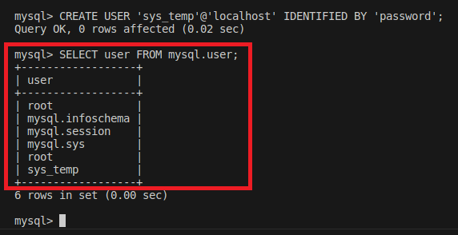
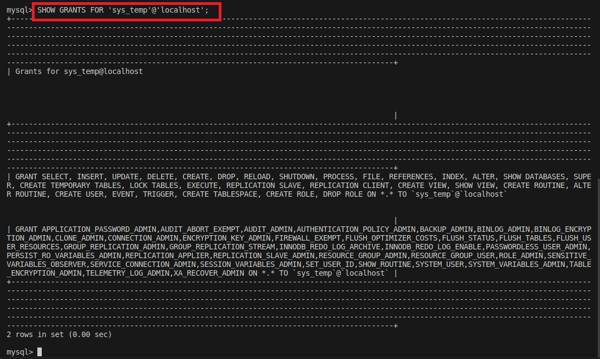
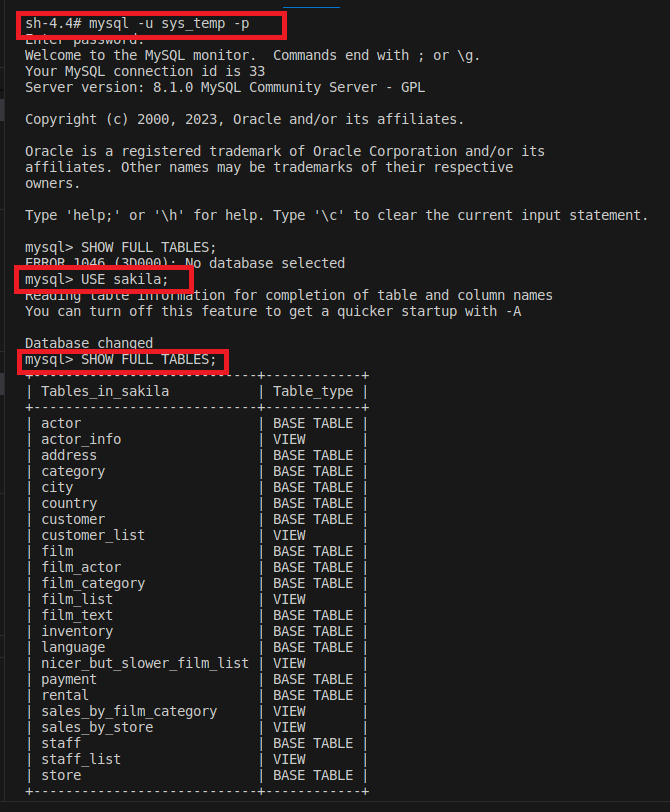
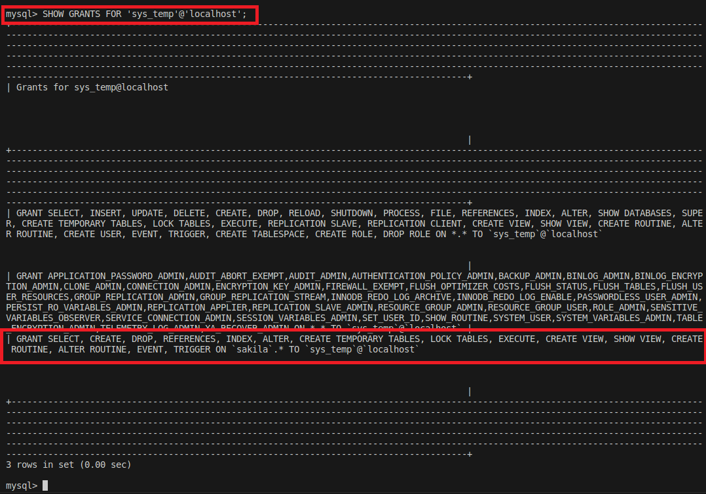

# Домашнее задание к занятию SYSDB-20 " «Работа с данными (DDL/DML)»" - `Шорохов Вячеслав`

---

### Задание 1. 

1.1. Поднимите чистый инстанс MySQL версии 8.0+. Можно использовать локальный сервер или контейнер Docker.

1.2. Создайте учётную запись sys_temp.

1.3. Выполните запрос на получение списка пользователей в базе данных. (скриншот)

1.4. Дайте все права для пользователя sys_temp.

1.5. Выполните запрос на получение списка прав для пользователя sys_temp. (скриншот)

1.6. Переподключитесь к базе данных от имени sys_temp.

Для смены типа аутентификации с sha2 используйте запрос:

```sql
ALTER USER 'sys_test'@'localhost' IDENTIFIED WITH mysql_native_password BY 'password';
```

1.6. По ссылке [https://downloads.mysql.com/docs/sakila-db.zip](https://downloads.mysql.com/docs/sakila-db.zip) скачайте дамп базы данных.

1.7. Восстановите дамп в базу данных.

1.8. При работе в IDE сформируйте ER-диаграмму получившейся базы данных. При работе в командной строке используйте команду для получения всех таблиц базы данных. (скриншот)

_Результатом работы должны быть скриншоты обозначенных заданий, а также простыня со всеми запросами._

#### Решение:

Простыня со всеми запросами:
```
Docker:
docker run --name docker_mysql -e MYSQL_ROOT_PASSWORD=password -v /home/vyach/sql/mysql:/var/lib/mysql -p 3306:3306 -d mysql:8.1
docker cp /home/vyach/sql/sakila-db docker_mysql:/sakila

MySQL:
mysql -u root -p
CREATE USER 'sys_temp'@'localhost' IDENTIFIED BY 'password';
GRANT ALL PRIVILEGES ON *.* TO 'sys_temp'@'localhost';
SELECT user FROM mysql.user;
SHOW GRANTS FOR 'sys_temp'@'localhost';
exit
mysql -u sys_temp -p
mysql> SOURCE /sakila/sakila-schema.sql;
mysql> SOURCE /sakila/sakila-data.sql;
USE sakila;
SHOW FULL TABLES;
```

`Выполните запрос на получение списка пользователей в базе данных:`


`Выполните запрос на получение списка прав для пользователя sys_temp`


`При работе в командной строке используйте команду для получения всех таблиц базы данных`


---

### Задание 2. 

Составьте таблицу, используя любой текстовый редактор или Excel, в которой должно быть два столбца: в первом должны быть названия таблиц восстановленной базы, во втором названия первичных ключей этих таблиц. Пример: (скриншот/текст)

```
Название таблицы | Название первичного ключа
customer         | customer_id
```
#### Решение:

```
Название таблицы | Название первичного ключа
actor         | actor_id
address       | address_id
category      | category_id
city          | city_id
counry        | country_id 
customer      | customer_id
film          | film_id
film_actor    | actor_id, film_id
film_category | film_id, category_id
film_text     | film_id
inventory     | inventory_id
language      | language_id
payment       | payment_id
rental        | rental_id
staff         | staff_id
store         | store_id
```

---

### Задание 3.

3.1. Уберите у пользователя sys_temp права на внесение, изменение и удаление данных из базы sakila.

3.2. Выполните запрос на получение списка прав для пользователя sys_temp. (скриншот)

_Результатом работы должны быть скриншоты обозначенных заданий, а также простыня со всеми запросами._

#### Решение:

Простыня со всеми запросами:
```
MySQL:
GRANT ALL PRIVILEGES ON sakila.* TO 'sys_temp'@'localhost';
REVOKE INSERT,UPDATE,DELETE ON sakila.* FROM 'sys_temp'@'localhost';
FLUSH PRIVILEGES;
SHOW GRANTS FOR 'sys_temp'@'localhost';
```

`Выполните запрос на получение списка прав для пользователя sys_temp`


---
