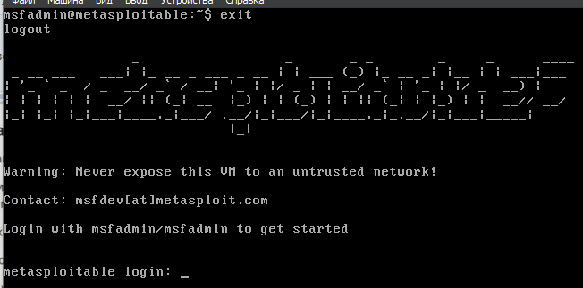
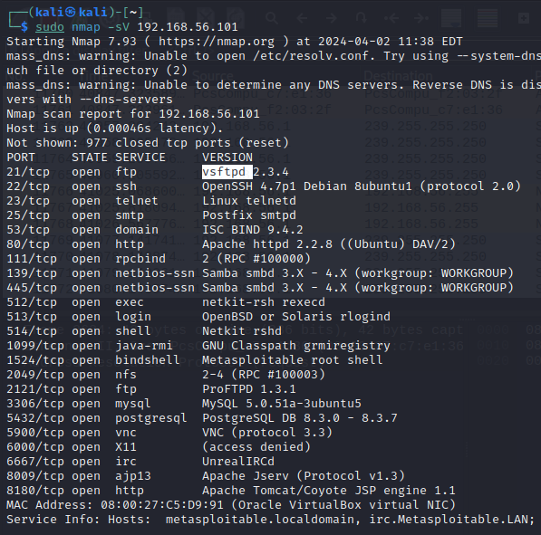
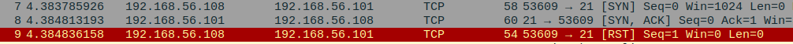
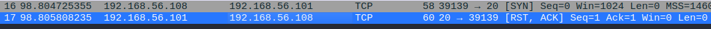
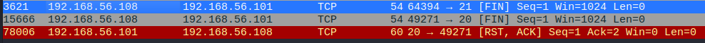
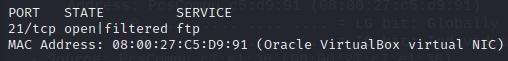
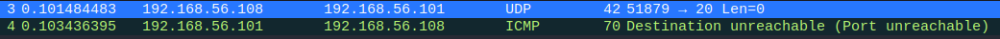
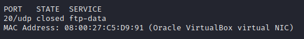

# Домашнее задание к занятию SYSSEC-27 
# «Уязвимости и атаки на информационные системы» - `Шорохов Вячеслав`

---

### Задание 1. 

Скачайте и установите виртуальную машину Metasploitable: [https://sourceforge.net/projects/metasploitable/](https://sourceforge.net/projects/metasploitable/).
Это типовая ОС для экспериментов в области информационной безопасности, с которой следует начать при анализе уязвимостей.
Просканируйте эту виртуальную машину, используя **nmap**.
Попробуйте найти уязвимости, которым подвержена эта виртуальная машина.
Сами уязвимости можно поискать на сайте [https://www.exploit-db.com/](https://www.exploit-db.com/).
Для этого нужно в поиске ввести название сетевой службы, обнаруженной на атакуемой машине, и выбрать подходящие по версии уязвимости.
Ответьте на следующие вопросы:
- Какие сетевые службы в ней разрешены?
- Какие уязвимости были вами обнаружены? (список со ссылками: достаточно трёх уязвимостей)
_Приведите ответ в свободной форме._
#### Решение:

Скачал и установил виртуальную машину Metaspoitable:


Просканировал виртуальную машину с помощью nmap, увидел следующие открытые сетевые порты и стоящие за ними службы: 
```bash
sudo nmap -sV 192.168.56.101
```


С помощью полученной информации от nmap (открытые порты и версии программного обеспечения) и сайта www.exploit-db.com я нашел следующие три уязвимости:
```bash
1. Samba exploit: 		https://www.exploit-db.com/exploits/33598
2. FTP exploit: 		https://www.exploit-db.com/exploits/17491
3. PostgreSQL exploit: 		https://www.exploit-db.com/exploits/46813
```


---

### Задание 2. 

Проведите сканирование Metasploitable в режимах SYN, FIN, Xmas, UDP.
Запишите сеансы сканирования в Wireshark.
Ответьте на следующие вопросы:
- Чем отличаются эти режимы сканирования с точки зрения сетевого трафика?
- Как отвечает сервер?
_Приведите ответ в свободной форме._

#### Решение:

Для описания типов сканирования использовался ресурс: https://nmap.org/man/ru/man-port-scanning-techniques.html
##### SYN
С помощью nmap провел сканирование Metasploitable в режиме SYN, просматривая трафик в Wireshark:
```bash
sudo nmap -sS -p 20 192.168.56.101
sudo nmap -sS -p 21 192.168.56.101
```



Вывод: 
SYN это используемый по умолчанию и наиболее популярный тип сканирования. Он способен сканировать тысячи портов в секунду при быстром соединении. Этот тип сканирования относительно ненавязчив и незаметен, т.к. при таком сканировании TCP соединение никогда не устанавливается до конца. Он также предоставляет ясную и достоверную дифференциацию между состояниями `открыт`, `закрыт` и `фильтруется`.
Эту технику часто называют сканированием с использованием полуотрытых соединений, т.к. вы не открываете полного TCP соединения. Вы посылаете SYN пакет, как если бы вы хотели установить реальное соединение и ждете. Ответы SYN/ACK указывают на то, что порт прослушивается (открыт), а RST (сброс) на то, что не прослушивается. Если после нескольких запросов не приходит никакого ответа, то порт помечается как фильтруемый. 

- На скриншоте наглядно видно, что если порт открыт (21), от хоста приходит  SYN, ACK, если порт закрыт (20), то приходит RST, ACK.

##### FIN
С помощью nmap провел сканирование Metasploitable в режиме FIN, просматривая трафик в Wireshark:
```bash
sudo nmap -sF -p 20 192.168.56.101
sudo nmap -sF -p 21 192.168.56.101
```



Вывод:
Null, FIN, Xmas. Эти три типа сканирования используют незаметную лазейку в [TCP RFC](http://www.rfc-editor.org/rfc/rfc793.txt), чтобы разделять порты на `открытые` и `закрытые`. На странице 65 RFC 793 говорится, что «если порт назначения ЗАКРЫТ .... входящий сегмент не содержащий RST повлечет за собой отправку RST в ответ.» 
Когда сканируется система отвечающая требованиям RFC, любой пакет, не содержащий установленного бита SYN, RST или ACK, повлечет за собой отправку RST в ответ в случае, если порт закрыт, или не повлечет никакого ответа, если порт открыт. Т.к. ни один из этих битов не установлен, то любая комбинация трех оставшихся (FIN, PSH и URG) будет являться правильной. Nmap использует это в трех типах сканирования:
Null сканирование (`-sN`)
Не устанавливаются никакие биты (Флагов в TCP заголовоке 0)
FIN сканирование (`-sF`)
Устанавливается только TCP FIN бит.
Xmas сканирование (`-sX`)
Устанавливаются FIN, PSH и URG флаги.
Эти три типа сканирования работают по одной схеме, различия только в TCP флагах установленных в пакетах запросов. Если в ответ приходит RST пакет, то порт считается `закрытым`, отсутствие ответа означает, что порт `открыт|фильтруется`. Порт помечается как `фильтруется`, если в ответ приходит ICMP ошибка о недостижимости (тип 3, код 1, 2, 3, 9, 10 или 13).

- На скриншоте видно, что после запроса на 21 порт, ответа не было, а в выводе nmap 21 порт обозначен как open|filtered, на запрос на 20 порт пришел ответ RST, ACK.

##### Xmas
С помощью nmap провел сканирование Metasploitable в режиме Xmas, просматривая трафик в Wireshark:
```bash
sudo nmap -sX -p 20 192.168.56.101
sudo nmap -sX -p 21 192.168.56.101
```


Вывод:
- Описание данного типа сканирования было также приведено выше. Помимо FIN в запросе устанавливаются PSH и URG флаги. По скриншоту видно что результат запроса в моем случае для режимов FIN и Xmas получился одинаковым.

##### UDP
С помощью nmap провел сканирование Metasploitable в режиме UDP, просматривая трафик в Wireshark:
```bash
sudo nmap -sU -p 20 192.168.56.101
```



Вывод:
UDP сканирование запускается опцией `-sU`. 
UDP сканирование работает путем посылки пустого (без данных) UDP заголовка на каждый целевой порт. Если в ответ приходит ICMP ошибка о недостижимости порта (тип 3, код 3), значит порт `закрыт`. Другие ICMP ошибки недостижимости (тип 3, коды 1, 2, 9, 10 или 13) указывают на то, что порт `фильтруется`. Иногда, служба будет отвечать UDP пакетом, указывая на то, что порт `открыт`. Если после нескольких попыток не было получено никакого ответа, то порт классифицируется как `открыт|фильтруется`. Это означает, что порт может быть открыт, или, возможно, пакетный фильтр блокирует его. Функция определения версии (`-sV`) может быть полезна для дифференциации действительно открытых портов и фильтруемых.

- По скриншоту видно, что в ответ на UDP запрос на закрытый 20 порт пришел ICMP ответ о недостижимости порта, и в выводе nmap написал, что порт закрыт.

---
