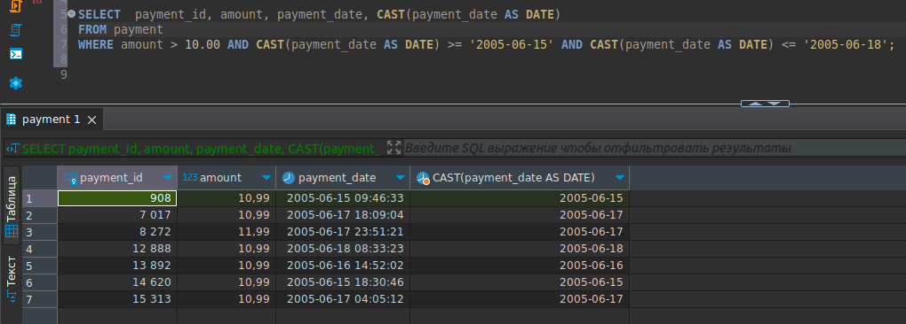

# Домашнее задание к занятию SDBSQL-20 
# «Индексы» - `Шорохов Вячеслав`

---

### Задание 1. 

Напишите запрос к учебной базе данных, который вернёт процентное отношение общего размера всех индексов к общему размеру всех таблиц.

#### Решение:

Получившийся запрос:
```sql
SELECT s.store_id, COUNT(c.customer_id), CONCAT(s2.last_name, ' ', s2.first_name), c2.city
FROM store s
JOIN customer c ON c.store_id = s.store_id
JOIN staff s2 ON s.manager_staff_id = s2.staff_id
JOIN address a ON a.address_id = s.address_id
JOIN city c2 ON c2.city_id = a.city_id
GROUP BY s.store_id, CONCAT(s2.last_name, ' ', s2.first_name), c2.city
HAVING COUNT(c.customer_id) > 300;
```

`Результат запроса:`


---

### Задание 2. 

Выполните explain analyze следующего запроса:

```sql
select distinct concat(c.last_name, ' ', c.first_name), sum(p.amount) over (partition by c.customer_id, f.title)
from payment p, rental r, customer c, inventory i, film f
where date(p.payment_date) = '2005-07-30' and p.payment_date = r.rental_date and r.customer_id = c.customer_id and i.inventory_id = r.inventory_id
```

- перечислите узкие места;
- оптимизируйте запрос: внесите корректировки по использованию операторов, при необходимости добавьте индексы.

#### Решение:

Получившийся запрос:
```sql
SELECT COUNT(film_id)
FROM film
WHERE length > (SELECT AVG(length) FROM film);
```

`Результат запроса:`


---
