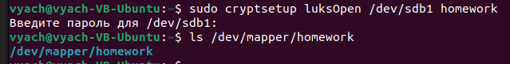
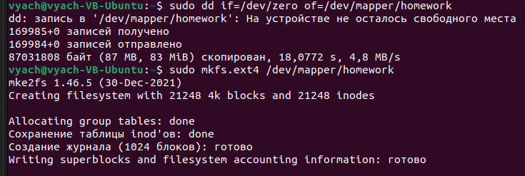
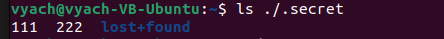
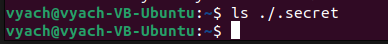

# Домашнее задание к занятию SYSSEC-27 
# «Защита хоста» - `Шорохов Вячеслав`

---

### Задание 1. 

1. Установите **eCryptfs**.
2. Добавьте пользователя cryptouser.
3. Зашифруйте домашний каталог пользователя с помощью eCryptfs.

_В качестве ответа пришлите снимки экрана домашнего каталога пользователя с исходными и зашифрованными данными._
#### Решение:

Привожу листинг команд, использованных при выполнении задания: 
```bash
sudo apt install ecryptfs-utils
sudo adduser cryptouser
sudo su root
cd /home/cryptouser
touch 111 222 3 333
ls /home/cryptouser
```

Скриншот с содержимым домашнего каталога пользователя cryptouser до шифрования: 


Произведем шифрование следующей командой:
```bash
sudo ecryptfs-migrate-home -u cryptouser
ls /home/cryptouser
```

На скриншоте видим содержимое каталога после шифрования:


---

### Задание 2. 

1. Установите поддержку **LUKS**.
2. Создайте небольшой раздел, например, 100 Мб.
3. Зашифруйте созданный раздел с помощью LUKS.

_В качестве ответа пришлите снимки экрана с поэтапным выполнением задания._

#### Решение:

Для выполнения задания установил gparted и cryptsetup: 
```bash
sudo apt install gparted
sudo apt install cryptsetup-bin
cryptsetup --version
```

Присоединил к виртуальной машине vdi жесткий диск на 100Мб и создал на нем раздел /dev/sdb1:


Шифрование раздела LUKS: 
```bash
sudo cryptsetup -y -v --type luks2 luksFormat /dev/sdb1
sudo cryptsetup luksOpen /dev/sdb1 homework
ls /dev/mapper/homework
sudo dd if=/dev/zero of=/dev/mapper/homework
sudo mkfs.ext4 /dev/mapper/homework
```
Вывод команд:






Монтирование "открытого" раздела: 
```bash
mkdir .secret
sudo mount /dev/mapper/homework .secret/

cd ./.secret
sudo touch 111 222
cd ..
ls ./.secret
```
Вывод команды "ls ./.secret" после указанных действий:


Завершение работы: 
```bash
sudo umount .secret
sudo cryptsetup luksClose homework
```

Вывод команды "ls ./.secret" после указанных действий:


---
