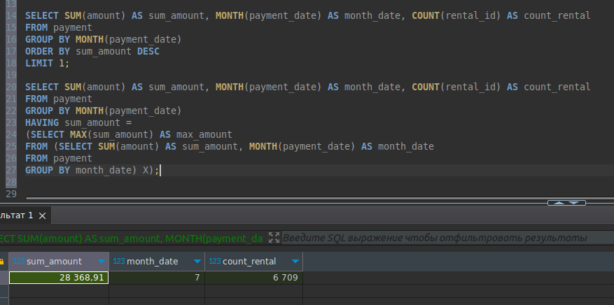
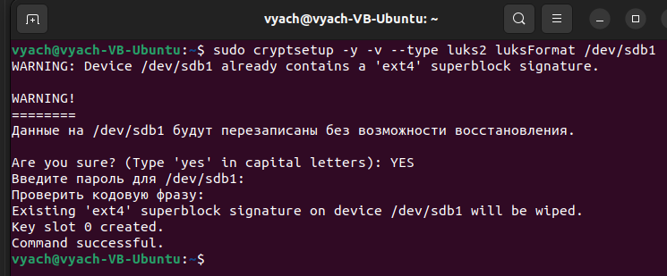

# Домашнее задание к занятию SDBSQL-20 
# «SQL. Часть 1» - `Шорохов Вячеслав`

---

### Задание 1. 

Получите уникальные названия районов из таблицы с адресами, которые начинаются на “K” и заканчиваются на “a” и не содержат пробелов.

#### Решение:

Получившийся запрос:
```sql
SELECT DISTINCT district
FROM address
WHERE district LIKE 'K%a' AND district NOT LIKE '% %';
```

`Результат запроса:`


---

### Задание 2. 

Получите из таблицы платежей за прокат фильмов информацию по платежам, которые выполнялись в промежуток с 15 июня 2005 года по 18 июня 2005 года **включительно** и стоимость которых превышает 10.00.

#### Решение:

Получившийся запрос:
```sql
SELECT payment_id, amount, payment_date, CAST(payment_date AS DATE)
FROM payment
WHERE amount > 10.00 AND CAST(payment_date AS DATE) >= '2005-06-15' AND CAST(payment_date AS DATE) <= '2005-06-18';
```

`Результат запроса:`


---

### Задание 3.

Получите последние пять аренд фильмов.

#### Решение:

Получившийся запрос:
```sql
SELECT r.rental_date, f.title
FROM rental r
JOIN inventory i ON i.inventory_id = r.inventory_id
JOIN film f ON i.film_id = f.film_id
ORDER BY rental_date DESC
LIMIT 5;
```

`Результат запроса:`



---

### Задание 4.

Одним запросом получите активных покупателей, имена которых Kelly или Willie.

Сформируйте вывод в результат таким образом:

- все буквы в фамилии и имени из верхнего регистра переведите в нижний регистр,
- замените буквы 'll' в именах на 'pp'.

#### Решение:

Получившийся запрос:
```sql
SELECT LOWER(REPLACE(first_name, 'LL', 'PP')), LOWER(last_name)
FROM customer
WHERE first_name LIKE 'Kelly' OR first_name LIKE 'Willie' AND active > 0;
```

`Результат запроса:`

