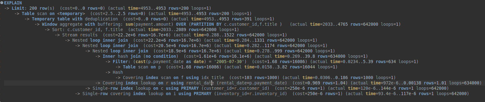
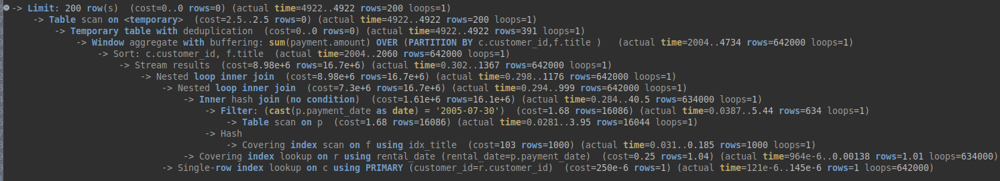
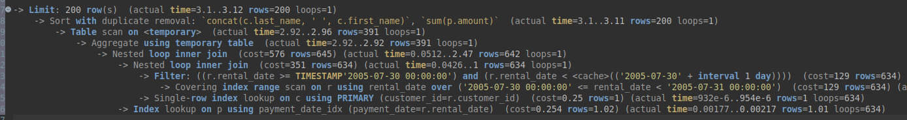
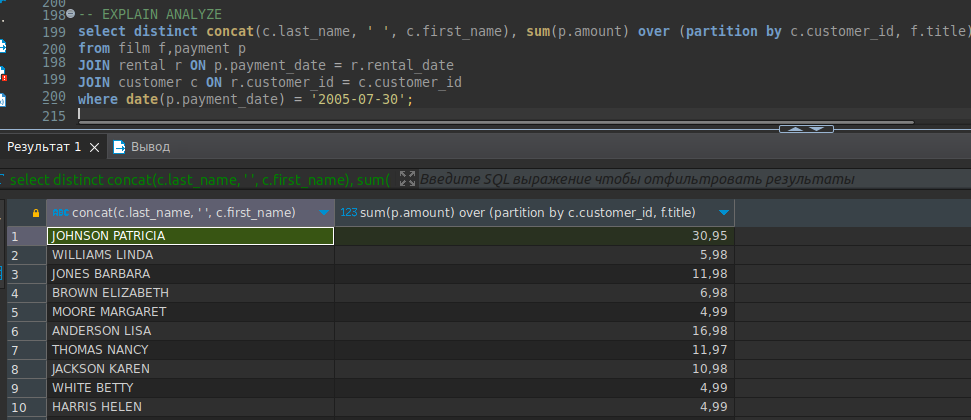
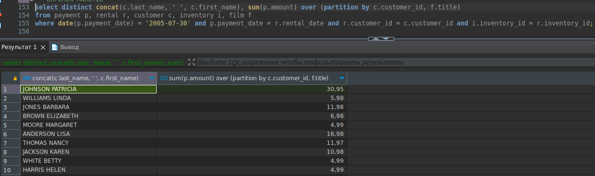

# Домашнее задание к занятию SDBSQL-20 
# «Индексы» - `Шорохов Вячеслав`

---

### Задание 1. 

Напишите запрос к учебной базе данных, который вернёт процентное отношение общего размера всех индексов к общему размеру всех таблиц.

#### Решение:

Берем значения из INFORMATION_SCHEMA.TABLES,  суммы всех индексов делим на сумму всех данных и умножаем на 100, для получения результата в процентах. 

Получившийся запрос:
```sql
SELECT SUM(index_length)/SUM(data_length)*100 AS homework
FROM INFORMATION_SCHEMA.TABLES;
```

`Результат запроса:`


---

### Задание 2. 

Выполните explain analyze следующего запроса:

```sql
select distinct concat(c.last_name, ' ', c.first_name), sum(p.amount) over (partition by c.customer_id, f.title)
from payment p, rental r, customer c, inventory i, film f
where date(p.payment_date) = '2005-07-30' and p.payment_date = r.rental_date and r.customer_id = c.customer_id and i.inventory_id = r.inventory_id
```

- перечислите узкие места;
- оптимизируйте запрос: внесите корректировки по использованию операторов, при необходимости добавьте индексы.

#### Решение:

Посмотрел вывод запроса, а также выполнил EXPLAIN ANALYZE, 
`EXPLAIN ANALYZE Первоначального запроса:`


Для оптимизации убрал лишнюю таблицу inventory из FROM и вместо аргументов WHERE добавил остальные таблицы через JOIN, получившийся запрос:
```sql
select distinct concat(c.last_name, ' ', c.first_name), sum(p.amount) over (partition by c.customer_id, f.title)
from film f,payment p
JOIN rental r ON p.payment_date = r.rental_date
JOIN customer c ON r.customer_id = c.customer_id
where date(p.payment_date) = '2005-07-30';
```

`EXPLAIN ANALYZE Получившегося запроса:`


По итогу оптимизации время почти не уменьшилось, поэтому было решено попробовать добавить индексы. Как показала проверка, индексы на дату значительно увеличивают время обработки запроса, поэтому ограничился индексом на размер платежа и составным индексом на имя фамилию покупателя:
```sql
CREATE INDEX first_last_idx ON customer(last_name, first_name);
CREATE INDEX amount_idx ON payment(amount);
```

`EXPLAIN ANALYZE Получившегося запроса после добавления индексов:`


Вывод: время обработки незначительно сократилось после добавления индексов.

`Скриншоты для проверки, что вывод до и после оптимизации запроса одинаковый`



---
