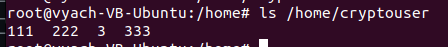
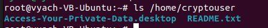
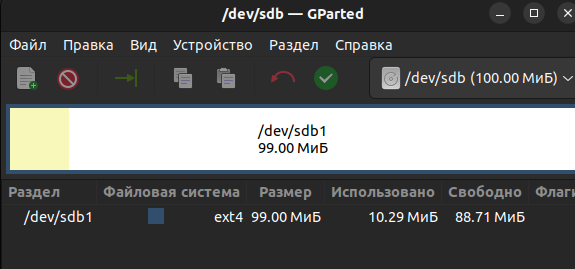

# Домашнее задание к занятию SDBSQL-20 
# «SQL. Часть 2» - `Шорохов Вячеслав`

---

### Задание 1. 

Одним запросом получите информацию о магазине, в котором обслуживается более 300 покупателей, и выведите в результат следующую информацию:

- фамилия и имя сотрудника из этого магазина;
- город нахождения магазина;
- количество пользователей, закреплённых в этом магазине.

#### Решение:

Получившийся запрос:
```sql
SELECT s.store_id, COUNT(c.customer_id), CONCAT(s2.last_name, ' ', s2.first_name), c2.city
FROM store s
JOIN customer c ON c.store_id = s.store_id
JOIN staff s2 ON s.manager_staff_id = s2.staff_id
JOIN address a ON a.address_id = s.address_id
JOIN city c2 ON c2.city_id = a.city_id
GROUP BY s.store_id, CONCAT(s2.last_name, ' ', s2.first_name), c2.city
HAVING COUNT(c.customer_id) > 300;
```

`Результат запроса:`



---

### Задание 2. 

Получите количество фильмов, продолжительность которых больше средней продолжительности всех фильмов.

#### Решение:

Получившийся запрос:
```sql
SELECT COUNT(film_id)
FROM film
WHERE length > (SELECT AVG(length) FROM film);
```

`Результат запроса:`


---

### Задание 3.

Получите информацию, за какой месяц была получена наибольшая сумма платежей, и добавьте информацию по количеству аренд за этот месяц.

#### Решение:

Получившийся запрос, первый вариант, где  пошел по простому пути:
```sql
SELECT SUM(amount) AS sum_amount, MONTH(payment_date) AS month_date, COUNT(rental_id) AS count_rental
FROM payment
GROUP BY MONTH(payment_date)
ORDER BY sum_amount DESC
LIMIT 1;
```

Получившийся запрос, второй вариант, где я решил подумать и использовать агрегатную функцию MAX и вложенные запросы:
```sql
SELECT SUM(amount) AS sum_amount, MONTH(payment_date) AS month_date, COUNT(rental_id) AS count_rental
FROM payment
GROUP BY MONTH(payment_date)
HAVING sum_amount =
(SELECT MAX(sum_amount) AS max_amount
FROM (SELECT SUM(amount) AS sum_amount, MONTH(payment_date) AS month_date
FROM payment
GROUP BY month_date) X);
```

`Результат запроса:`



---
